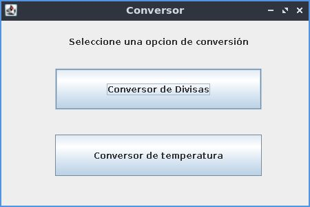
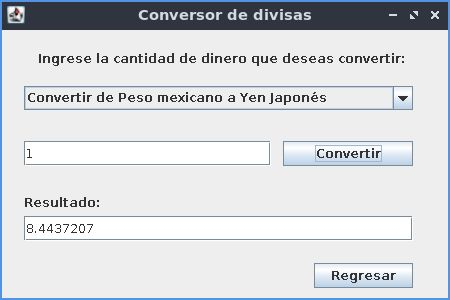
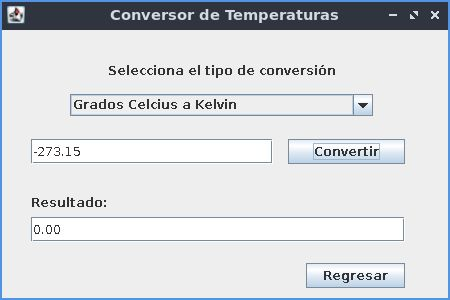

# Conversor de Monedas y Temperaturas

Este proyecto es un programa conversor, que cubre la tematica de conversor de divisas y conversor de temperaturas.

## Conversor de divisas 

Conversiones contempladas:

* Dólar estadounidense - Peso Mexicano
* Euros - Peso Mexicano
* Libras Esterlinas - Peso Mexicano
* Yen Japonés - Peso Mexicano
* Won sul-coreano - Peso Mexicano
* Peso Mexicano - Dólar estadounidense 
* Peso Mexicano - Euros
* Peso Mexicano - Libras Esterlinas
* Peso Mexicano - Yen Japonés
* Peso Mexicano - Won sul-coreano

## Conversor de Temperaturas

Conversiones contempladas:

* Grados Celcius - Grados Farenheit
* Grados Celcius - Kelvin
* Grados Farenheit - Grados Celcius
* Grados Farenheit - Kelvin
* Kelvin - Grados Celcius
* Kelvin - Grados Farenheit

## Interfaz de usuario

* Pantalla principal

* Conversor de divisas 

* Conversor de Temperaturas

## Instrucciones de uso

El proyecto fue diseñado en el IDE Eclipse, por lo que se recomienda su uso dentro de este IDE. El proyecto fue desarrollado como un proyecto maven por lo que se debe de abrir el proyecto en el IDE antes de ejecutarlo. La ejecución del programa se realiza con la clase Main. La ventana resultante dara la opcion del conversor a elejir. Seleccione el conversor deseado e ingrese la cantidad numerica correspondiente. El conversor acepta numeros positivos, negativos y decimales. El conversor de temperatura no acepta valores menores al valor teorico del cero absoluto.